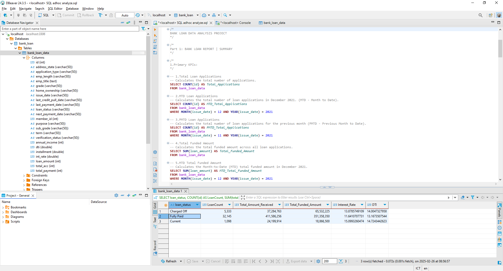
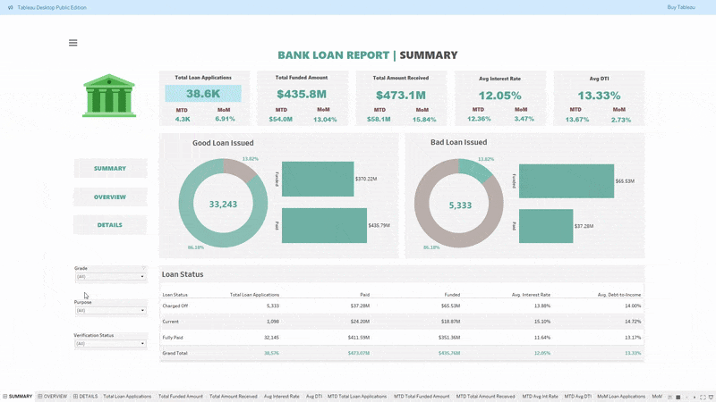
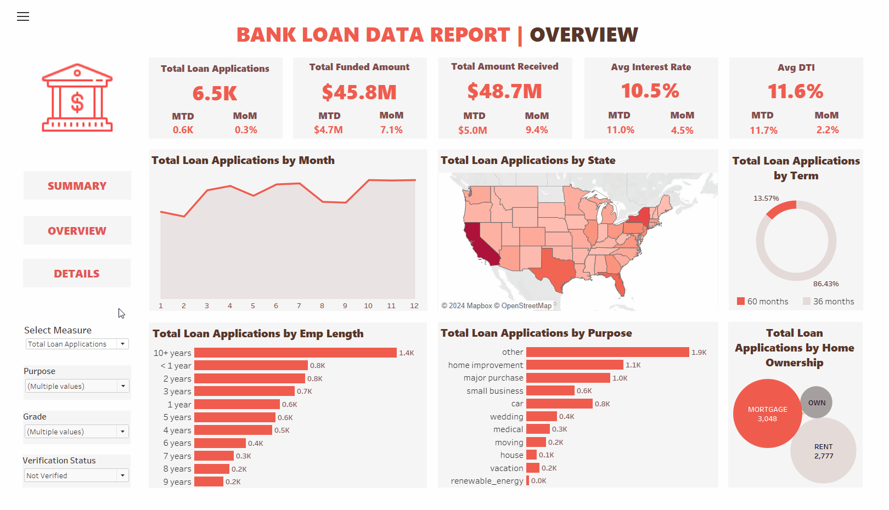
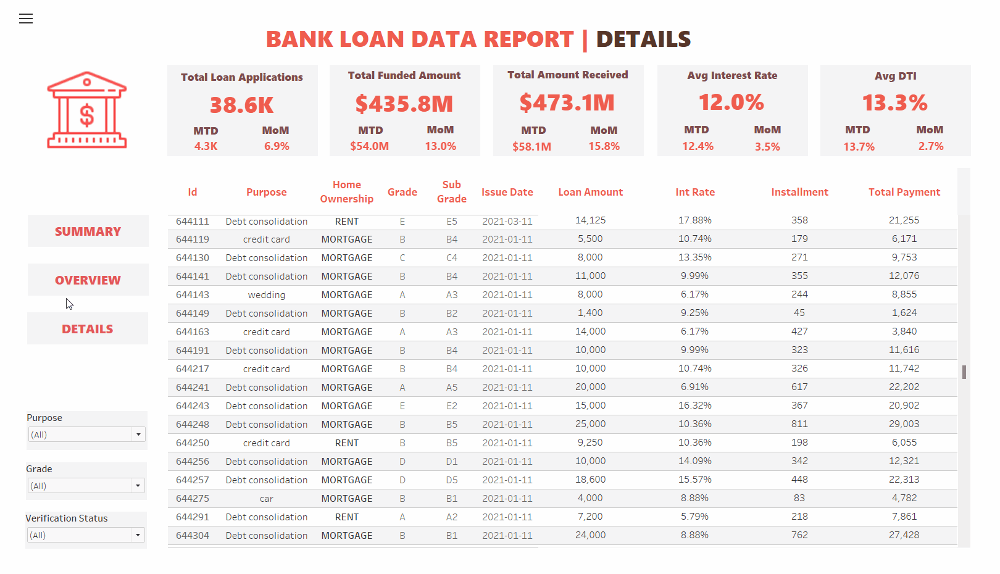

  <h2 align="center">Bank Loan Data Analysis PROJECT</h2>

  This project apply SQL to analyze a dataset of U.S. bank loan data for the year 2021 to identify general trend and insight,   and create in Tableau three interactive dashboards: Summary, Overview, and Details.

  

  <a href="https://public.tableau.com/views/BankLoanReport_17405014016650/SUMMARY?:language=en-US&:sid=&:redirect=auth&:display_count=n&:origin=viz_share_link"><strong>➥ Live Demo</strong></a>
  

   

*Dashboard Demo Screenshots*

  *If your screen cannot fully display all the content of the dashboard, please use Tableau Public "See this in full screen" function to view the entire dashboard.*
  

## I. Analysis with SQL
Dataset was imported into MySQL database using DBeaver import tools. Then a series of descriptive question was done using SQL (MySQL flavor). Details on SQL analysis can be found in the [SQL script](<SQL adhoc analyze.sql>)

### 📖 Key Terms in the Report  

- **MTD (Month-to-Date):** The total accumulated value from the start of the current month up to today.  
- **MoM (Month-over-Month):** Measures the change (percentage or absolute) from the previous month.  
- **DTI (Debt-to-Income Ratio):** Assesses a borrower's debt relative to income, indicating their ability to manage additional debt.  
- **Good Loan:** Includes loans classified as **"Fully Paid"** or **"Current"** in loan status.  
- **Bad Loan:** Refers to loans labeled **"Charged Off"**, indicating default.  
- **Grade:** A credit risk rating for loans, where higher grades denote lower risk. **Sub-grade** provides finer risk differentiation within each grade.  
- **Verification Status:** Indicates whether a borrower's financial details have been verified for accuracy.  
- **Loan Status:** Represents the current state of a loan (e.g., **Fully Paid, Current, Default**), tracking its repayment progress.  

*SQL Demo Screenshots*

## II. Dashboard in Tableau

The **Summary Dashboard** allows you to filter bank loan data for 2021 by **Purpose, Grade, and Verification Status**.  
Key insights include: 
- Total Loan Applications, Funded Amount, and Amount Received
- Average Interest Rate and Debt-to-Income Ratio (DTI)
- Monthly averages and growth rates
- Breakdown of Good vs. Bad Loans and Loan Status  

Use the interactive filters to explore trends and patterns in the dataset.  

*GIF Sample Demonstrating Operations on the Summary Dashboard*
 

In the **`Overview Dashboard`**, you can filter by **Purpose, Grade,** and **Verification Status** to analyze bank loan data for 2021. This dashboard provides insights into **monthly summaries, loan distribution across U.S. states, loan terms, borrower employment history, loan purposes, and homeownership status**. Clicking on any diagram dynamically updates all charts and tables for interactive exploration.  

*GIF Sample Demonstrating Operations on the Overview Dashboard*
 

In the **`Details Dashboard`**, you can also filter by **Purpose, Grade,** and **Verification Status**. Additionally, you can **sort and filter columns** in the main table and scroll through to view all **loan records from 2021**.  

*GIF Sample Demonstrating Operations on the Details Dashboard*
 

🎉 Excited to explore the dashboard yourself? Check it out on my **[Tableau Public](https://public.tableau.com/views/BankLoanReport_17405014016650/SUMMARY?:language=en-US&:sid=&:redirect=auth&:display_count=n&:origin=viz_share_link)** and have fun analyzing the data! 🚀  

